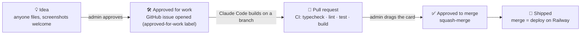

# 🎨 VibeCode — supabase-vibe-starter

**A GitHub template for vibe-coding a real app with confidence — auth, per-user
data, realtime, and file storage on day one, plus an in-app board where the app
builds its own next feature.**

[](https://vitejs.dev)
[](https://react.dev)
[](https://www.typescriptlang.org)
[](https://supabase.com)
[](https://railway.app)
[](.github/workflows/ci.yml)
[](#)

> Support this project by visiting the sponsor below and learning more about
> the Zapier SDK! 🚀 [Sponsored by Zapier SDK](https://bit.ly/4w9EuLX) · 📺
> [Watch the video](https://youtu.be/wP0s8BLi-ZM) · 📖
> [Read the Substack](https://dailyaistudio.substack.com/p/vibe-coding-with-confidence)

Instead of the built-in "for real" prompting Lovable/Replit bake in, this repo
carries your own opinions — in [`CLAUDE.md`](CLAUDE.md) and the
[`vibe-coding-with-confidence`](.claude/skills/vibe-coding-with-confidence) skill
— so an AI coding agent builds the same secure way every time. It's not a
hello-world: sign in, upload a document, and watch it sync live — that already
proves the whole stack.

## Features

| Area | What you get |
|---|---|
| 🔐 **Auth** | Supabase Auth, gated app (no anonymous phase) — email+password **and** magic link, open sign-up, no email verification required. |
| 🗂️ **Per-user data (RLS)** | A `documents` table, default-deny RLS with four owner-gated policies (`select`/`insert`/`update`/`delete` on `auth.uid() = user_id`), and an `updated_at` trigger. |
| 📌 **Document workspace** | Grid/list views, search by name or file type, per-document editable notes, and **pin-to-top** for the documents you care about most. |
| 📦 **Private file storage** | A private `documents` Storage bucket, objects scoped to `{user_id}/…`, served to the owner only via short-lived signed URLs. |
| ⚡ **Realtime** | The dashboard subscribes to Postgres changes filtered to the current user — a change in one tab shows up in another instantly. |
| 🧩 **Tabbed app shell** | History-API-backed tabs (`/` Documents, `/features` Feature requests) — linkable, bookmarkable, back-button friendly, no router dependency. |
| 🛠️ **AI Feature Pipeline** | An in-app kanban (`Idea → Approved for work → Approved to merge → Shipped`). Anyone files an idea (with screenshots); an admin drags to approve; Claude Code builds it on a branch and opens a PR; dragging again squash-merges — merge **is** deploy. |
| 👤 **Admin roles** | A minimal `profiles.is_admin` trust boundary — first signup becomes admin; only admins can approve/merge feature cards or move lanes. |
| 🧪 **AI Quality foundation** | Versioned prompts (`prompts` → `prompt_versions`), eval suites/cases, a server-side `run-eval` engine that grades answers with Claude, and a promote-only-if-green gate (`promote_prompt_version`) — the schema + engine an AI-quality workbench builds on. |
| ✅ **CI/CD** | GitHub Actions: typecheck + lint + test + build on every push/PR, automatic Supabase migrations and edge-function deploys on merge, and this README auto-refreshing itself on every merge to `main`. |
| 🔒 **HTTPS everywhere** | Railway serves the built app over HTTPS by default; every push to `main` redeploys. |

## The self-building pipeline

Dragging a card between lanes *is* the approval — a human always stays on the
two levers that matter: **spend AI effort** and **ship to production**.



The AI never touches `main` — it only ever opens a PR. See the
[`ai-feature-pipeline`](.claude/skills/ai-feature-pipeline) skill for the full
mechanics (the edge function, the GitHub Action, the trust boundary).

## Tech stack

- **Frontend:** Vite + React + TypeScript, plain CSS (no UI framework, no router).
- **Backend:** Supabase — Postgres + RLS, Auth, Realtime, Storage, Edge Functions.
- **AI:** Claude Code (via `anthropics/claude-code-action`) builds approved
  features; the Anthropic API grades AI-quality evals server-side.
- **Hosting:** Railway, deploying from GitHub on every push, HTTPS by default.

## Getting started

> **Deploying end to end?** [`DEPLOY.md`](DEPLOY.md) is the ordered,
> click-by-click runbook (GitHub → Supabase → Railway) with a verification
> checklist and common snags.

1. **Use this template** → Create a new repository (or clone this repo).
2. Create a **Supabase** project, enable Email auth (confirm-email **off**),
   and add your local + deployed origins to Redirect URLs.
3. Apply `supabase/migrations/` (via the "Apply Supabase migrations" GitHub
   Action or `supabase db push` locally) to create the tables, RLS policies,
   and the private Storage bucket.
4. Copy `.env.example` to `.env` and fill in the two **public** `VITE_` values
   from Supabase → Project Settings → API.

```bash
npm install
npm run dev        # http://localhost:5173
```

Other scripts:

```bash
npm run typecheck  # tsc --noEmit
npm run lint       # eslint
npm test           # vitest
npm run build      # typecheck + production build into dist/
npm start          # serve the built dist/ on $PORT (used by Railway)
```

Then point Railway at the repo (it reads `railway.json`) and set the same two
`VITE_` vars in the service. Every push to `main` redeploys over HTTPS.

## What to change per project

- **`CLAUDE.md`** — retitle and describe your actual app.
- **The domain** — `documents` is a live smoke-test of the stack. Rename or
  replace it with your real entities, keeping the same shape (RLS, realtime,
  storage) — the `vibe-coding-with-confidence` skill has copy-paste patterns.
- **The Features board** — is a capstone; only wire it up once you have real
  accounts, an admin role, and a GitHub repo whose merges deploy.

## The method

[`.claude/skills/vibe-coding-with-confidence/`](.claude/skills/vibe-coding-with-confidence)
encodes the security rules, the phased build, and reusable patterns (auth,
data model + RLS, realtime, storage, Railway deploy). It loads automatically in
Claude Code — prefer the **simplest thing that is still secure**, and keep RLS
on for every user-data table.

[`.claude/skills/ai-feature-pipeline/`](.claude/skills/ai-feature-pipeline)
encodes the "idea → shipped code" board above: the concept, the exact GitHub
mechanics, and a build spec adapted to this starter's conventions.
